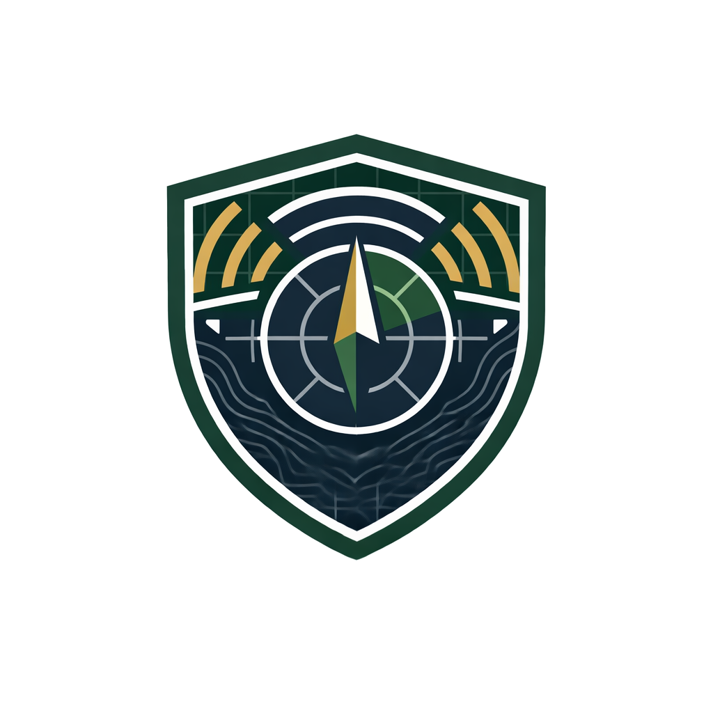

<p align="center">
  
</p>

# Ordo Defensionis

Live tactical dashboard for Brazil-focused SIPRI arms transfer data.

## Local Run

```powershell
cd D:\GitHub\ordo-defensionis\app
npm install
npm run dev
```

This starts:

- the Vite frontend on `http://localhost:5173`
- the local SIPRI proxy on `http://127.0.0.1:8787`

The frontend calls `/api/sipri/orders`, and Vite proxies that request to the backend so the browser never hits SIPRI directly.
If `SUPABASE_URL` and `SUPABASE_SERVICE_ROLE_KEY` are set, the backend also stores asset overrides in your hosted Supabase project. Without those env vars it falls back to the local JSON file.

## Useful Commands

```powershell
npm run dev
npm run build
npm run refresh:data
```

`npm run refresh:data` updates the saved fallback snapshot at [src/data/sipri-brazil-orders.json](D:/GitHub/ordo-defensionis/app/src/data/sipri-brazil-orders.json).

## Backend Proxy

The proxy lives at [server/server.mjs](D:/GitHub/ordo-defensionis/app/server/server.mjs).

It:

- fetches live data from SIPRI
- caches the response in memory for a short interval
- falls back to the saved snapshot if the upstream service fails
- persists refresh-safe asset admin overrides in Supabase when configured
- falls back to [server/data/asset-overrides.json](D:/GitHub/ordo-defensionis/app/server/data/asset-overrides.json) when Supabase env vars are not present
- persists approved cover and gallery selections in [server/data/asset-image-metadata.json](D:/GitHub/ordo-defensionis/app/server/data/asset-image-metadata.json)

## Supabase Setup

This app is prepared for a hosted Supabase project. It does not require a local Supabase stack.

1. Create a Supabase project.
2. Open the SQL Editor and run [supabase/sql/001_asset_overrides.sql](D:/GitHub/ordo-defensionis/app/supabase/sql/001_asset_overrides.sql).
3. Copy [.env.example](D:/GitHub/ordo-defensionis/app/.env.example) to `.env` and fill in:
   - `SUPABASE_URL`
   - `SUPABASE_SERVICE_ROLE_KEY`
   - `GEMINI_API_KEY` for AI-assisted admin drafting
   - `GEMINI_MODEL` such as `gemini-2.5-flash`
4. Start the app with `npm run dev`.

The server uses the service-role key, so the browser never talks to Supabase directly. The SQL script creates:

- the `public.asset_overrides` table
- indexes for source-name correlation
- an `updated_at` trigger
- helper SQL functions for listing, upserting, and deleting overrides in your hosted project

A future-ready hosted schema for persisted image selections is also included at [supabase/sql/002_asset_image_metadata.sql](D:/GitHub/ordo-defensionis/app/supabase/sql/002_asset_image_metadata.sql). The app still keeps image metadata local for now.

## Asset Pipeline

Static media folders live under [public/assets](D:/GitHub/ordo-defensionis/app/public/assets).

- Custom platform icons: [public/assets/icons/assets](D:/GitHub/ordo-defensionis/app/public/assets/icons/assets)
- Category fallbacks: [public/assets/icons/categories](D:/GitHub/ordo-defensionis/app/public/assets/icons/categories)
- Branch fallbacks: [public/assets/icons/branches](D:/GitHub/ordo-defensionis/app/public/assets/icons/branches)
- Asset galleries: [public/assets/gallery](D:/GitHub/ordo-defensionis/app/public/assets/gallery)

If you need non-standard file names, titles, captions, or credits, register them in [src/config/assetMedia.ts](D:/GitHub/ordo-defensionis/app/src/config/assetMedia.ts).

For quick uploads, drop files into [public/assets/gallery/images](D:/GitHub/ordo-defensionis/app/public/assets/gallery/images) using the pattern `{designation}-1`, `{designation}-2`, `{designation}-3` and so on, for example `Igla-S-1.png`. The local backend scans that folder automatically, uses `-1` as the main image, and exposes `-2+` as additional gallery images for the matching asset designation.

Selected platforms can also be enriched with manual dossier data in [src/config/assetProfiles.ts](D:/GitHub/ordo-defensionis/app/src/config/assetProfiles.ts). That layer is separate from SIPRI data and is intended for curated specs, mission systems, curious facts, and official reference links.

## Admin Page

Open `http://localhost:5173/admin` to edit asset overrides.

The admin page can change:

- asset name
- description
- branch
- category
- sub-category
- technical data rows
- main image path or URL
- gallery images, captions, alt text, and credits

The admin page also includes `Generate with AI`. That action calls the backend proxy, which in turn calls Gemini with grounded web search to draft better values for the current asset. The generated values are only applied to the in-memory editor state. Review them, inspect the source cards, then decide whether to save the refresh-safe override fields.

The admin page also includes `Suggest images`. That action uses Gemini grounded search to discover trustworthy source pages, extracts candidate image URLs from those pages, and lets you choose a cover image plus additional gallery images before saving.

On refresh, only these text fields stay persisted through the override layer: name, description, branch, category, and sub-category. Technical rows remain session-local. Approved cover and gallery selections persist through the separate image metadata layer.

## Notes

- Vite warns that Node `20.19+` or `22.12+` is preferred. The app still runs on `20.18.3` in this environment, but upgrading is recommended.
- The current detail pages use SIPRI procurement data, approved imagery when available, and curated dossier layers for selected platforms.
